# Cortex Workmate 产品需求文档（PRD）

| 项目 | 内容 |
|---|---|
| 产品名称 | Cortex Workmate（移动端） |
| 文档版本 | v1.0 |
| 更新日期 | 2026-06-11 |
| 作者 | Jianing（PM） |
| 状态 | 评审中 |
| 关联文档 | [全界面截图与说明（44 屏）](./app-screens.md) |

---

## 一、背景与机会

### 1.1 问题

一线知识工作者（PM / 研发 / 运营 / 销售）的日常被三类事务持续消耗：

1. **重复性周期工作**：每日整理 PR、汇总日历、竞品巡检、写周报——内容模式固定，但每天都要人工跑一遍；
2. **会议记录负担**：录音 → 转写 → 提炼纪要 → 拆行动项，一场 1 小时的会议常常要再花 30 分钟做整理；
3. **跨工具碎片化**：信息分散在日历、邮箱、GitHub、Slack、Jira、文档库里，"收集 + 拼装"占据了大量低价值时间。

通用聊天助手（ChatGPT 类产品）解决了"问答"，但没有解决"替我办事"：它们**没有持续记忆**、**不能定时自动执行**、**没有对外部工具的授权管控**——用户既不敢把数据交给它，也无法让它长期值守。

### 1.2 机会与定位

**Cortex Workmate = 随身的 AI 工作搭子**：一个 7×24 常驻、有记忆、能跨工具替你执行重复事务，并在关键动作上征求你授权的个人工作助理。

三个差异化支点：

| 支点 | 含义 | 对应模块 |
|---|---|---|
| **持续协作** | 与 Workmate 的对话是一条连续流，不分 session、有长期记忆 | 对话 / 记忆 |
| **定时自动化** | 用一句话把周期事务托付出去，到点自动执行并回报结果 | 定时任务 / 通知 |
| **可控的工具执行** | 工具调用全透明；动用日历 / 邮箱 / 代码库前先审批，接外部服务前先确认连接 | 审批卡 / MCP 连接 / 通知 |

### 1.3 本期范围（重要）

本期交付为**移动端高保真交互原型**，用于验证产品方向、交互方案与视觉规范，并作为后续正式开发的需求基线：

- 纯前端实现（React + TypeScript），**无真实后端 / 大模型 / OAuth**；AI 回复、工具调用、转写均由脚本化 mock 引擎驱动；
- **定时任务不模拟到点自动触发**：原型演示以「立即运行」代替（运行约 2.6s 后产出结果对话 + 完成通知）；
- 数据持久化在本地（localStorage），提供「重置演示数据」恢复完整演示态；
- 中文为默认语言，界面全量中英双语；浅色 / 深色 / 跟随系统三种主题。

---

## 二、目标用户与核心场景

**目标用户**：以 Cobo 内部一线知识工作者为原型——产品经理、研发、运营增长、销售 BD。

| 场景 | 用户旅程 | 命中模块 |
|---|---|---|
| 每日 PR 巡检 | "每天早上 9 点帮我整理 GitHub PR" → 到点自动执行 → 通知提醒 → 点开看结果 → 引用结果继续追问 | 对话→定时任务→通知 |
| 产品评审会 | 开会录音 → 选「会议纪要」模板转译 → 看逐字稿与总结 → 发现要发给销售，换「客户总结」模板重新生成总结 | 会议记录 |
| 数据授权 | 让 Workmate 看日历 → 它发起授权申请（用途 / 权限 / 有效期） → 我在对话里或通知中心批准 → 它继续执行 | 审批卡→通知 |
| 接入外部工具 | "把这条同步到 Slack" → Workmate 提示需要连接 Slack → 一键 OAuth 连接 → 继续执行 | MCP 连接卡 |
| 多智能体协作 | 切到 Agents 模式 → 选「合规审查助手」处理 KYT 问题 → 按项目归档会话 | Agents 对话 |

---

## 三、设计原则

1. **iOS 原生质感**：SF 字体体系、玻璃拟态头部、底部 Sheet / ActionSheet、灵动岛适配的手机框展示；
2. **对话即入口**：定时任务的创建、记忆的保存等核心动作都通过对话完成，功能页只做"管理与回看"；
3. **透明与可控**：每一次工具调用可展开看函数 / 参数 / 结果；敏感能力先审批（含有效期），外部服务先确认连接；
4. **状态稳定**：通知等结构化信息的标题创建即定稿，状态变化只体现在状态药丸，不改标题；
5. **全量双语 + 主题**：界面 chrome 100% 中英双语（默认中文）；浅 / 深 / 跟随系统，切换带全页渐变过渡。

---

## 四、信息架构

```
登录（Google / 扫码） ──► 新手引导（首次，3 页） ──► 主界面
主界面（底部 3 Tab）
├── 对话
│   ├── Workmate 模式（连续流）── 收藏中心 / 历史搜索 / 通知
│   └── Agents 模式（会话/项目）── 会话历史 / 智能体选择器 / MCP 快捷面板 / 通知
├── 助手
│   ├── 定时任务 ── 任务详情 ── 编辑 / 执行结果对话
│   └── 会议记录 ── 会议详情（转写/总结）── 录音页 / 转译模板选择 / 重新转译
└── 我的
    ├── 个人信息中心
    ├── Workmate 配置：基础配置（人设）/ MCP 服务器（列表/详情）/ 记忆（含回收站）/ 技能
    └── 偏好与支持：语言 / 模式 / 版本 / 重置演示数据 / 退出登录
全局：通知中心（任意页右上铃铛进入）· Toast · 确认弹窗 · 底部 Sheet
```

导航采用「Tab + 覆盖层（overlay）栈」模型：二级页默认从右侧滑入、可逐层返回；底部弹窗（Sheet）用于选择与轻量表单。**方向例外**：录音页自底部弹入（沉浸态）、Agents 会话历史自左侧滑入（抽屉语义）、历史搜索为淡入。

---

## 五、功能需求

> 每个模块按「场景价值 → 界面 → 需求点 → 边界与异常」组织；需求点编号规则：模块缩写-序号。

### 5.1 登录与引导

<p>
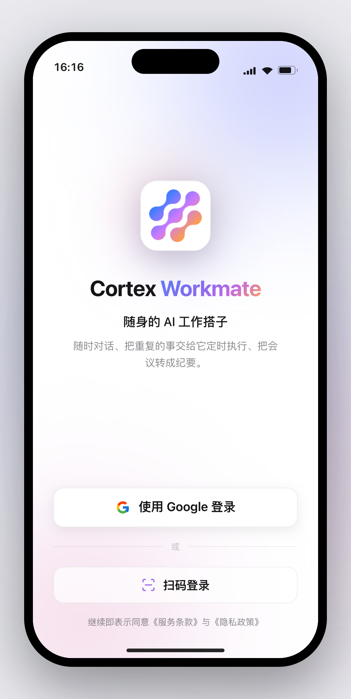
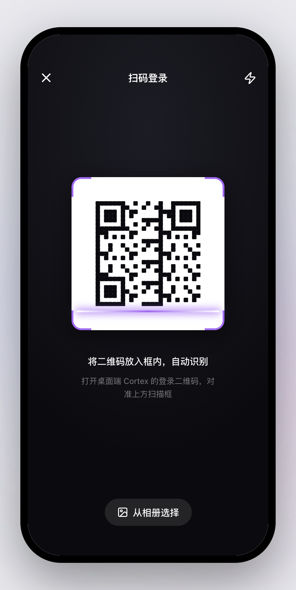
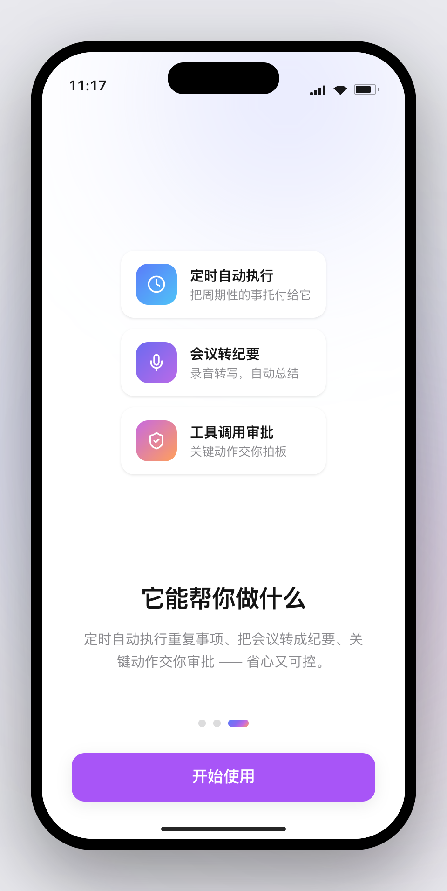
</p>

| 编号 | 需求 | 说明 |
|---|---|---|
| AUTH-01 | Google 登录 | 主按钮；mock 直接成功（loading ≈1s）。首次登录进入引导，老用户直接进主界面 |
| AUTH-02 | 扫码登录 | 相机取景框 + 扫描线动画 + 「从相册选择」「手电筒」；约 2.4s 自动识别成功，走与 Google 登录一致的后续流程 |
| AUTH-03 | 新手引导 | 3 页横滑（欢迎 / 智能助手 / 三大能力卡），页码圆点指示；右上「跳过」、末页「开始体验」；完成后持久化标记，不再出现 |
| AUTH-04 | 条款入口 | 底部展示《服务条款》《隐私政策》同意说明 |

**边界**：引导只在首次登录出现；登录态持久化，刷新不掉登录。

---

### 5.2 对话 · Workmate 模式（产品核心）

#### 5.2.1 连续对话流

<p>
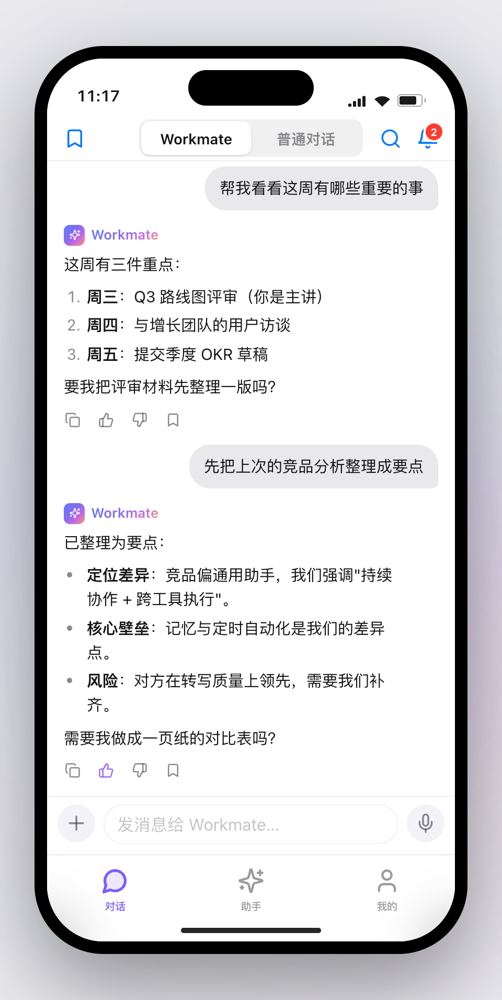
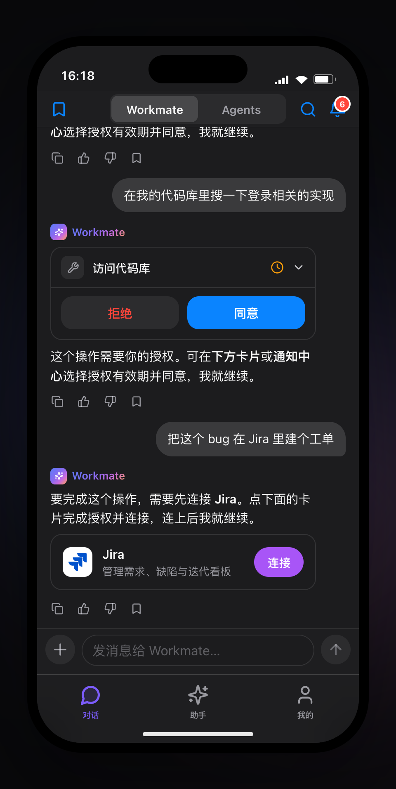
</p>

| 编号 | 需求 | 说明 |
|---|---|---|
| WM-01 | 连续不分 session | 与 Workmate 的全部对话在一条时间流里，不需要管理会话；向上滚动分页加载更早消息 |
| WM-02 | 流式回复 | 助手回复按「思考过程（可折叠）→ 工具调用卡 → 正文打字机流式」呈现；生成中可停止 |
| WM-03 | 消息操作 | 助手回复下方：复制 / 赞 / 踩（踩弹出原因选择）/ **收藏**（书签，仅 Workmate 模式） |
| WM-04 | 工具调用卡 | 折叠态 = 图标 + 标题 + 状态（调用中 spinner / 成功 ✓ / 失败 ✗ / 待授权 ⏱）；展开 = 函数名 + 参数（JS 风格代码块、语法着色）+ 结果（超长折叠，可「展开更多」） |
| WM-05 | 输入能力 | 文本；附件（照片 / 文件，图片出缩略图、文件显类型，可逐个移除；原型不校验文件大小，**正式版需补充大小限制**）；**全屏编辑器**（输入有内容时出现展开入口，全屏态保留头部与底部 Tab，草稿在展开/收起间保留） |
| WM-06 | mock 意图引擎 | 识别并演示：定时任务创建 / 保存记忆 / 授权类请求（日历·邮箱·代码库）/ MCP 连接触发（Slack·Jira·Notion·飞书）/ OKR 多步工具调用 / 连接失败演示 / 通用问答 |
| WM-07 | 空态引导 | 对话为空时显示问候卡（标题随人设名称变化）+ 4 条建议提示词，点选即作为消息发送 |

<p>
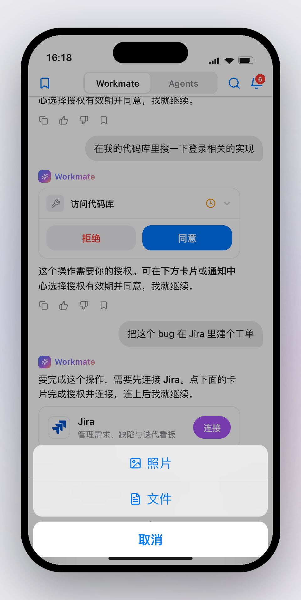
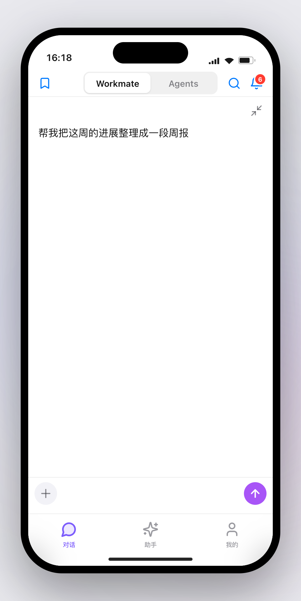
</p>

#### 5.2.2 对话内授权审批卡（Tool Call 审批）

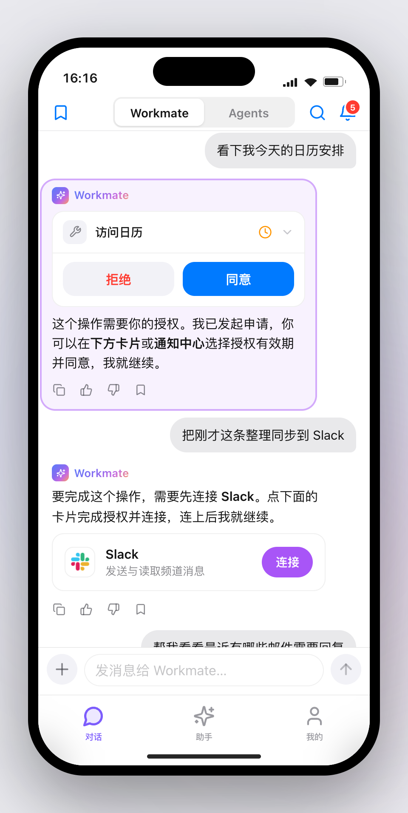

| 编号 | 需求 | 说明 |
|---|---|---|
| WM-10 | 触发 | 当请求涉及敏感能力（日历 / 邮箱 / 代码库）时，Workmate 不直接执行，而是插入一张「待授权」工具卡并同步产生一条审批通知 |
| WM-11 | **第一级可操作** | 审批操作常驻在卡片标题下方（**无需展开**即可操作）：拒绝 / 同意 两个动作，保持极简；**同意默认授予 7 天有效期**，已同意态展示「已同意 · 有效期 7 天」；展开仅追加函数与参数等技术细节 |
| WM-12 | 双端同步 | 同意 / 拒绝后：卡片状态变为成功（绿 ✓，并续写执行结果正文）或失败（红 ✗ + “用户拒绝授权”）；通知中心对应通知的状态药丸同步更新（待审批 → 已同意 / 已拒绝） |
| WM-13 | 审批数据模型 | 申请的用途说明、权限范围、有效期随通知记录留存（当前版本不在卡片上展示）；**有效期自定义选择器为正式版规划项**，本期固定 7 天 |

#### 5.2.3 对话内 MCP 连接卡

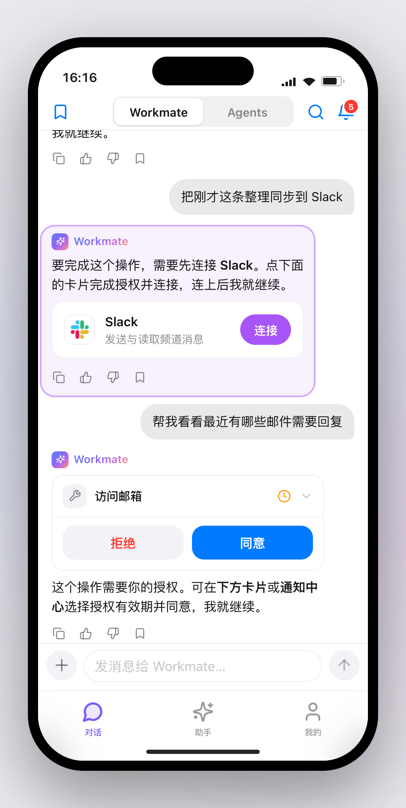

| 编号 | 需求 | 说明 |
|---|---|---|
| WM-15 | 触发 | 请求依赖未连接的 MCP 服务器（如 Slack / Jira）时，回复中插入连接卡（服务 Logo + 名称 + 描述 + 「连接」按钮），并产生一条连接请求通知 |
| WM-16 | 连接流程 | 点「连接」→ 授权中 → 连接中 → 绿色「已连接」；连接成功后 Workmate 自动续上一条回复继续任务 |
| WM-17 | 状态同步 | 连接成功后，「我的 → MCP 服务器」中该服务变为已启用；通知中心药丸 待连接 → 已连接 |

#### 5.2.4 历史搜索与收藏

<p>
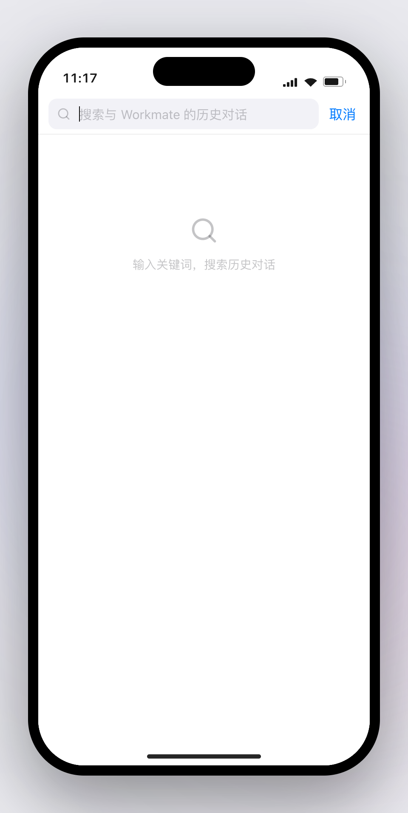
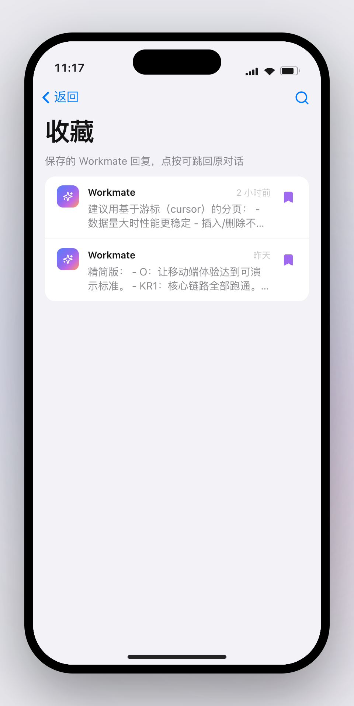
</p>

| 编号 | 需求 | 说明 |
|---|---|---|
| WM-20 | 历史搜索 | 顶部搜索入口；关键词即时过滤连续流，结果含 头像 + 角色 + 时间 + 命中片段高亮 + 计数；点结果**跳回原消息**并高亮 1.8s（高亮外框与消息操作图标保持安全间距，不重叠） |
| WM-21 | 收藏 | 助手回复可一键收藏 / 取消（书签实心切换 + toast）；收藏中心按收藏时间倒序，支持搜索、跳回原文、取消收藏；空态有引导文案 |

---

### 5.3 对话 · Agents 模式

<p>
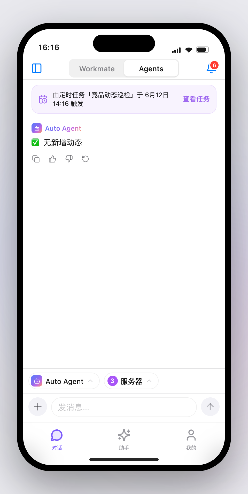
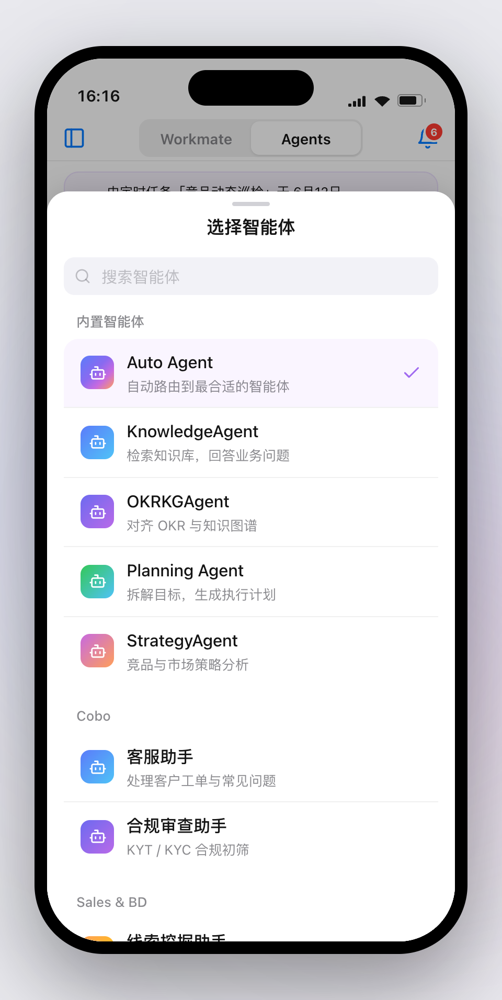
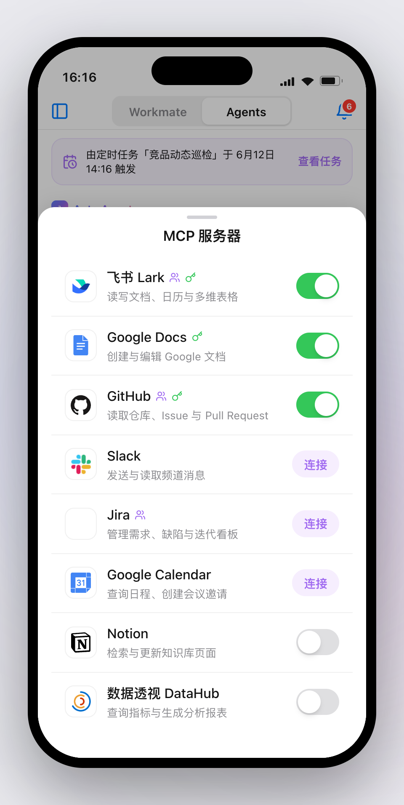
</p>

| 编号 | 需求 | 说明 |
|---|---|---|
| AG-01 | 模式切换 | 顶部分段控件「Workmate / Agents」一键切换；Agents 模式按**会话 / 项目**组织（与 Workmate 连续流互补） |
| AG-02 | Agent 栏 | 输入框上方常驻两个 pill：左 = 当前智能体（头像 + 名称），右 = MCP 服务器（已启用计数） |
| AG-03 | 智能体选择器 | 底部弹窗 + 搜索；按组织分组：内置智能体（Auto Agent / KnowledgeAgent / OKRKGAgent / Planning Agent / StrategyAgent）、Cobo（客服助手 / 合规审查助手）、Sales & BD、Operation & Growth、RD、Default；当前项打勾，点选即切换（toast 反馈），后续回复以该智能体署名 |
| AG-04 | MCP 快捷面板 | 对话内直接启停 MCP 服务器（开关 / 「连接」），不必跳设置页；启用数实时回显在 pill 上 |
| AG-05 | 会话历史 | 左上历史入口：项目分组 + 未分组会话；支持新建会话、新建项目、重命名、移动到项目、删除（删项目时可选连带删除会话）；定时任务的执行结果对话也归档在此（带任务来源横幅） |
| AG-06 | 消息编辑重发 | 用户消息支持「编辑」并重发（仅 Agents 模式） |
| AG-07 | 重新生成 | 助手回复支持「重新生成」（丢弃当前回复重答，仅 Agents 模式） |
| AG-08 | 空态引导 | 无会话时显示引导页（开始新对话 + 建议提示词） |

**两种模式的消息操作差异**：

| 操作 | Workmate | Agents |
|---|---|---|
| 复制 / 赞 / 踩 | ✓ | ✓ |
| 收藏（书签） | ✓ | — |
| 编辑重发（用户消息） | — | ✓ |
| 重新生成（助手回复） | — | ✓ |

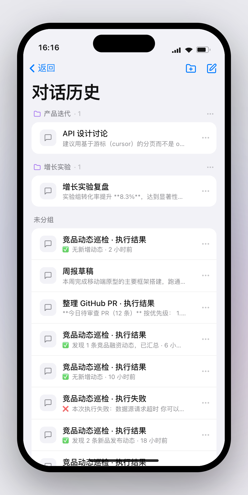

---

### 5.4 助手 · 定时任务

<p>
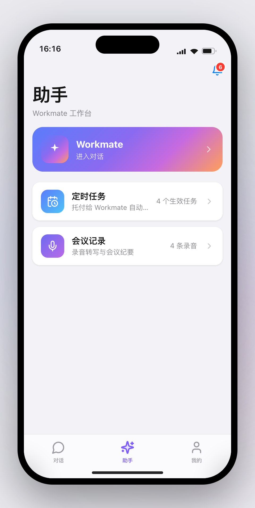
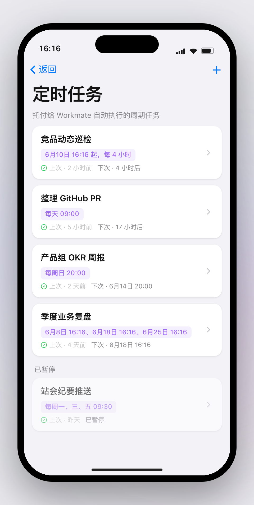
</p>

#### 5.4.1 创建（仅通过对话）

| 编号 | 需求 | 说明 |
|---|---|---|
| TASK-01 | 自然语言创建 | 在 Workmate 对话中说「每天 9 点整理 GitHub PR」即创建；引擎解析三种调度：**每天 HH:MM**、**每周（对话解析支持单个星期）**、**每隔 N 分钟 / 小时**；周内多选、指定日期等更丰富的规则在编辑表中调整（见 TASK-16） |
| TASK-02 | 信息不足反问 | 有定时意图但解析不出时间时，不猜测，主动反问「多久执行一次、什么时间」 |
| TASK-03 | 创建反馈 | 创建成功后对话内插入「已创建定时任务」卡片（名称 / 计划 / 下次运行 / 查看任务入口），并产生一条任务通知 |
| TASK-04 | 列表「+」 | 任务列表的「+」不直接建表单，而是跳回 Workmate 并预填创建提示词（保持"对话即入口"原则） |

#### 5.4.2 列表与详情

<p>
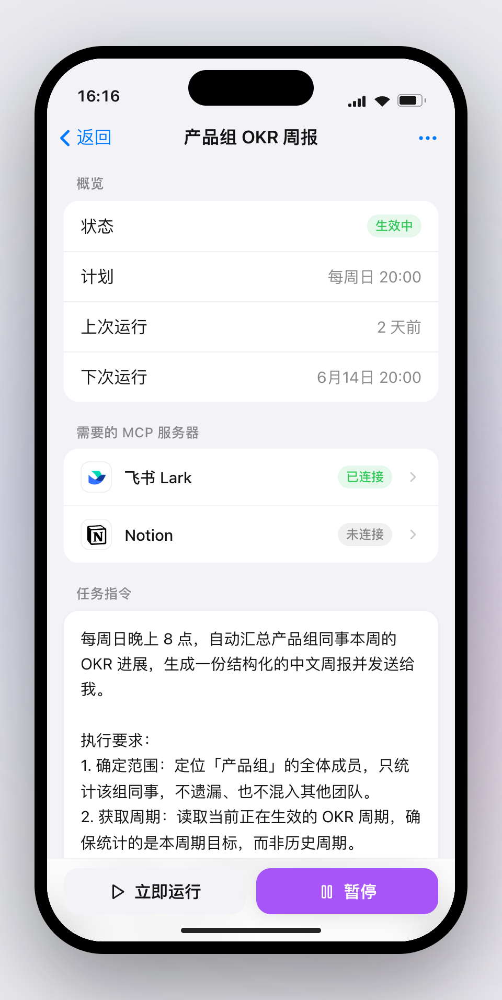
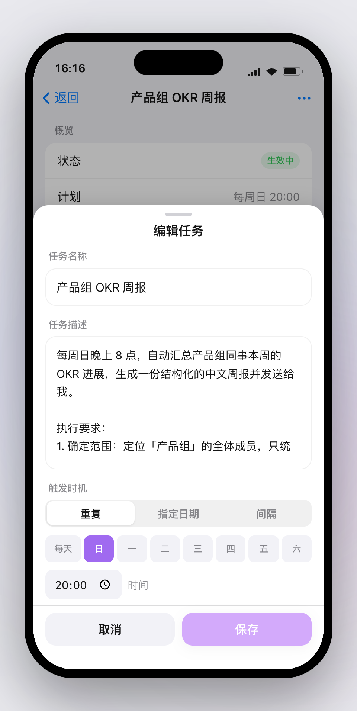
</p>

| 编号 | 需求 | 说明 |
|---|---|---|
| TASK-10 | 列表排序 | 启用任务按**下次运行时间升序**在前；已暂停任务单独分组、置灰下沉；运行中显示 spinner |
| TASK-11 | 列表信息 | 名称 + 调度规则 chip + 下次运行 + 上次结果（✓/✗） |
| TASK-12 | 详情概览 | 状态（生效中 / 已暂停）、计划、上次运行、下次运行（**始终为未来时间**，加载时重算） |
| TASK-13 | MCP 依赖 | 「需要的 MCP 服务器」区块：每个依赖服务显示连接状态（已连接 / 未连接），可点入服务详情处理 |
| TASK-14 | 运行记录 | 每次运行（无论成败）生成一条记录：状态 + 时长 + 摘要 + **「打开对话」**（每行都有，失败也可查看） |
| TASK-15 | 操作栏 | 底部双按钮：主 = 暂停 / 继续，副 = 立即运行；**暂停中的任务也可「立即运行」，且运行后保持暂停**；立即运行反馈链：卡片转运行中 → 约 2.6s → 生成结果对话 + 完成通知 + toast（mock 运行必成功，失败态由种子数据演示）。本期不模拟到点自动触发（见 1.3） |
| TASK-16 | 编辑 | ⋯ 菜单 → 编辑：名称 / 指令 / **触发时机三模式** —— ① 周期重复（周内多选 + 「每天」快捷 + 时间）② 指定日期（添加多个具体日期时间，每个时间运行一次，运行完无下次）③ 每隔一段时间（每 N 分钟 / 小时 / 天，可设开始时间或立即起算）；**未改动时「保存」不可点**（dirty 门控）；清空名称保存时回退为原名称；删除需二次确认 |

#### 5.4.3 执行结果与引用提问

<p>
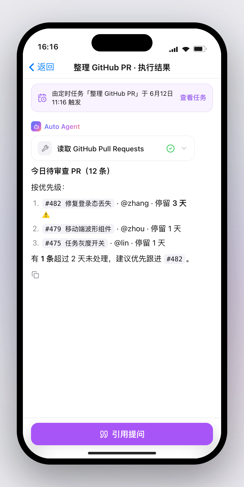
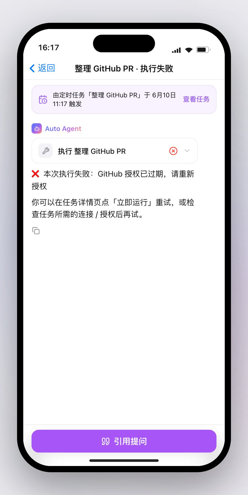
</p>

| 编号 | 需求 | 说明 |
|---|---|---|
| TASK-20 | 结果对话 | 每次执行生成一条结果对话：顶部来源横幅（由定时任务「X」于 … 触发 + 查看任务）、工具调用卡 + 结果正文；从任务详情「打开对话」进入为**只读**视图（仅「复制」，无赞踩 / 重试 / 输入框）；该对话同时归档于 Agents 会话历史，从历史打开可继续追问 |
| TASK-21 | 引用提问 | 结果页底部「引用提问」：跳回 Workmate，把该次执行结果作为**引用块**附在输入框上，用户继续输入问题；发送后引用块展示在用户气泡上方，Workmate 基于结果上下文作答（失败结果给排查建议） |
| TASK-22 | 失败呈现 | 失败运行展示红色错误工具卡 + 失败原因；同样支持复制与引用提问 |

---

### 5.5 助手 · 会议记录

#### 5.5.1 列表与录音

<p>
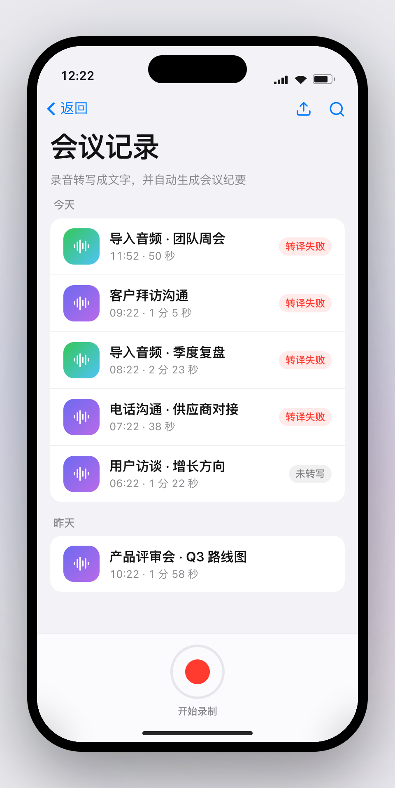
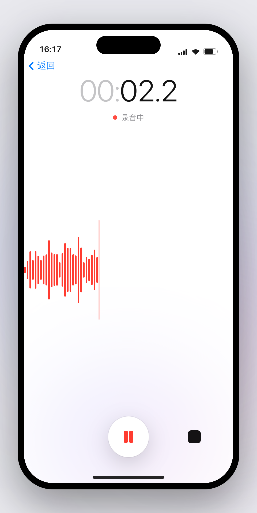
</p>

| 编号 | 需求 | 说明 |
|---|---|---|
| MEET-01 | 列表 | 按 今天 / 昨天 / 更早 分组；行 = 来源图标（录音 / 导入两种配色区分）+ 标题 + 时间·时长 + 状态药丸。药丸由单一 `status` 驱动：**转译中**（蓝色，药丸背景作为微型进度条从左到右填充）/ **转译失败**（红色外露，提示需重试）/ **未转写**（中性灰）；已完成不显示药丸；支持标题搜索 |
| MEET-02 | 入口布局 | 底部居中「开始录制」（录像机式大按钮）；「上传音频」为次要入口，置于右上搜索图标左侧 |
| MEET-02a | 上传音频 | 选择本地音频文件 → 标题取文件名（去扩展名）、时长读取音频元数据（读取失败回退默认值）→ **弹出与录音相同的命名弹窗**（含「保存后转译」多选，默认勾选）→ 保存为会议 + toast「已导入音频」；勾选则进入与录音完全一致的统一转译流程 |
| MEET-03 | 录音页 | 三星录音机风格：大号计时器（含十分之一秒）+ 滚动镜像波形（录制红色；暂停波形变灰、写头回中）；控制 = 中央 暂停/继续 大圆钮 + 右侧「结束」方块；**录制中无丢弃入口** |
| MEET-04 | 权限降级 | 请求麦克风权限被拒时引导：可改用「模拟波形」继续演示，或改为上传音频 |
| MEET-05 | 保存 | 「结束」→ 命名弹窗（含「保存后转译」多选框，**默认勾选**；取消则回到暂停态而非丢弃）→ 勾选则保存后**立即开始转译**（MEET-06），不勾选则存为「未转写」；录制中点返回需确认（未保存录音将丢失） |
| MEET-06 | **保存后转译（上传 + 转写统一）** | 命名弹窗内「保存后转译」多选（默认勾选）。转译背后是 云端上传 + 转写 两步，但对用户**统一表达为一个「转译中」状态**（列表 + 详情）：列表显示蓝色「转译中」药丸且**药丸背景作为微型进度条填充**（一个药丸同时承载状态与进度）；详情页全屏进度条，阶段文案从「正在上传到云端…」过渡到转写各阶段。不再有独立的「上传中 / 上传失败」状态。不勾选则存为「未转写」，用户可后续在详情页手动转译 |
| MEET-07 | 转译失败与重试 | 转译（上传或转写任一阶段）失败 → 列表药丸变红色「转译失败」外露；详情页显示失败原因 + **「重试转译」**主按钮（重新弹模板选择 → 走统一转译流程），成功后变「已完成」；播放器全程可用，⋯ 菜单（重命名 / 删除）不受影响 |
| MEET-08 | 中断恢复 | 转译进行中刷新 / 杀掉 App → 恢复后该会议标记「转译失败（转译中断，请重试）」，手动重试、不自动续传；**例外**：重新转译（已有内容）被中断 → 回退「已完成」保留原结果。老上传字段数据自动归并为「转译失败」 |

#### 5.5.2 转译：模板选择 + 总结备注

<p>
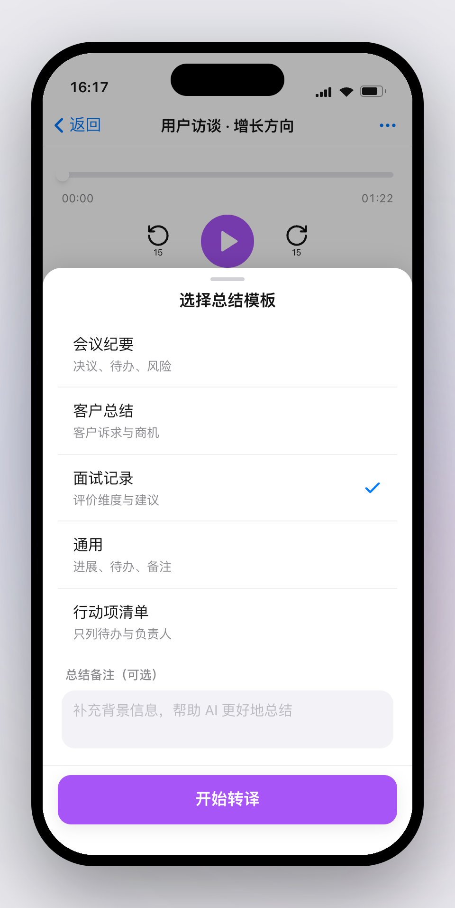
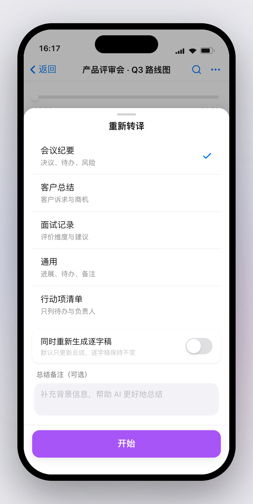
</p>

| 编号 | 需求 | 说明 |
|---|---|---|
| MEET-10 | 先选模板再转译 | 点「转译」先弹「选择总结模板」：**5 个模板单选** —— 会议纪要（决议/待办/风险）、客户总结（客户诉求与商机）、面试记录（评价维度与建议）、通用（进展/待办/备注）、行动项清单（只列待办与负责人）；**不同模板 = 不同的总结内容格式**，逐字稿不受模板影响 |
| MEET-11 | 智能推荐 | 默认选中项按会议标题智能推荐（如「用户访谈」→ 面试记录、「客户」→ 客户总结、「评审/会议」→ 会议纪要） |
| MEET-12 | 总结备注（可选） | 模板下方提供「总结备注」输入框，用于给 AI 补充背景信息；备注会以「背景补充」引用块写进总结开头，并随会议保存 |
| MEET-13 | 转译过程 | 全屏转译态：首次转译先「正在上传到云端…」再走 4 阶段文案（准备音频 → 识别语音 → 区分说话人 → 生成总结）+ 进度条；刷新中断 → 标记「转译失败」可重试（见 MEET-08），不留半成品 |
| MEET-14 | **重新转译** | 已完成的会议在 ⋯ 菜单提供「重新转译」：重新选模板（**预选当前模板**）、备注**回填上次内容**；**总结一定重新生成**；「同时重新生成逐字稿」为可选开关（**默认关**，hint 说明默认只更新总结） |
| MEET-15 | 结果区分 | 仅总结 → 短进度（"正在重新生成总结…"）+ toast「已更新总结」，逐字稿保持不变；含逐字稿 → 完整进度 + toast「已重新生成逐字稿与总结」 |
| MEET-16 | 失败统一处理 | 不再区分上传 / 转写失败——转译任一阶段失败都统一为「转译失败」，列表红色药丸外露 + 详情「重试转译」（走首次转译路径：重新选模板、重建逐字稿与总结），见 MEET-07 |

#### 5.5.3 会议详情

<p>
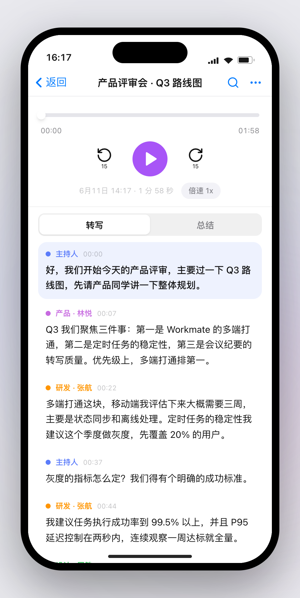
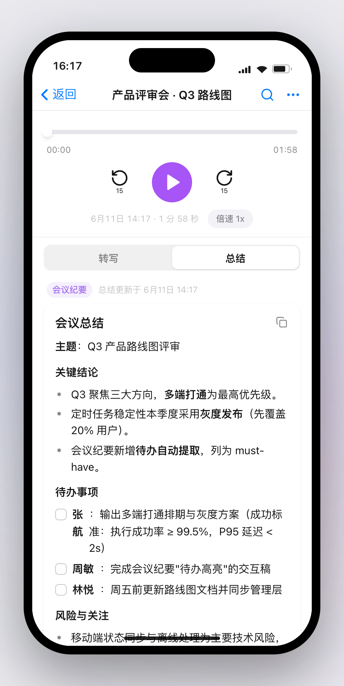
</p>

| 编号 | 需求 | 说明 |
|---|---|---|
| MEET-20 | 常驻播放器 | 任何状态都显示：进度条拖拽、±15s、倍速（1x / 1.5x / 2x）、录音时间与时长 |
| MEET-21 | 逐字稿 | 说话人着色区分；点击片段定位播放进度；播放时当前片段高亮并自动滚动跟随 |
| MEET-22 | AI 总结 | 总结卡上方显示**当前模板 chip + 「总结更新于 …」时间戳**（让"仅重新生成总结"也有可见变化）；Markdown 正文 + 复制按钮 |
| MEET-23 | 转写搜索 | 已完成会议右上提供转写内容搜索（命中高亮、点结果定位播放） |
| MEET-24 | ⋯ 菜单 | 已完成：重新转译 / **复制逐字稿全文**（含说话人前缀，与总结卡上的复制总结为两个独立动作、各自 toast）；通用：重命名 / 删除（删除二次确认，连带转写与总结） |

---

### 5.6 通知中心

<p>
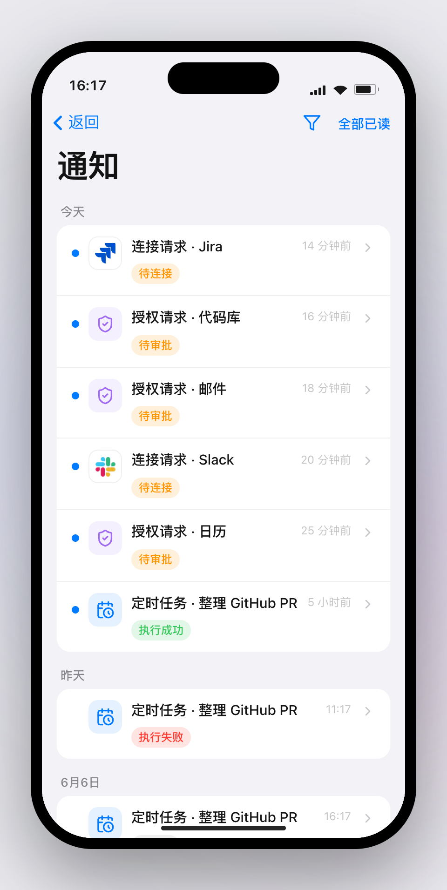
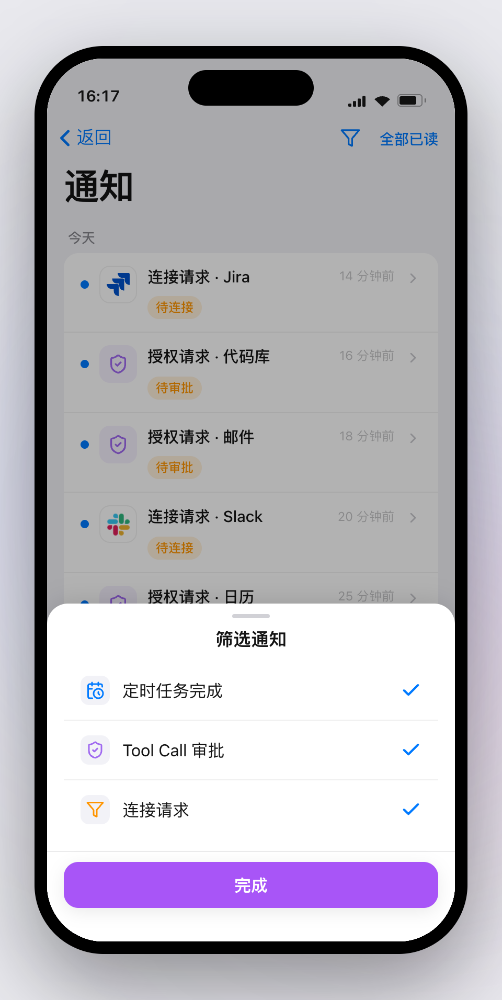
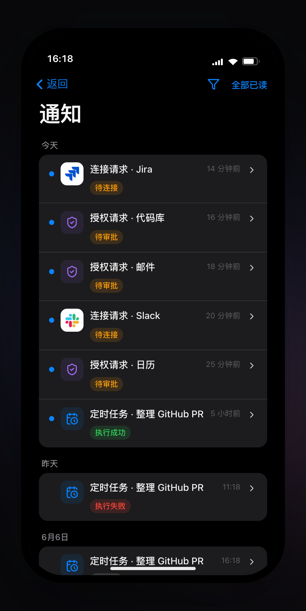
</p>

| 编号 | 需求 | 说明 |
|---|---|---|
| NTF-01 | 三类通知 | ① 定时任务状态（已创建 / 执行成功 / 执行失败）② Tool Call 审批 ③ MCP 连接请求 |
| NTF-02 | **标题结构化且稳定** | 标题创建时定稿、永不随状态改变：`定时任务 · {任务名}` / `授权请求 · {能力}` / `连接请求 · {服务名}`；**状态只体现在第二行状态药丸**（待审批 / 已同意 / 已拒绝 / 待连接 / 已连接 / 执行成功 / 执行失败 / 已创建），药丸实时派生（如连接成功瞬间 待连接→已连接） |
| NTF-03 | 时间聚合 | 按 今天 / 昨天 / 具体日期 分组展示，组内时间倒序；行首未读蓝点（固定列对齐） |
| NTF-04 | 分类跳转 | 点击即标记已读并跳转：任务类 → 该次运行结果对话（无运行记录则任务详情）；审批类 / 连接类 → **跳回 Workmate 对话内对应卡片**（滚动定位 + 高亮），在原上下文完成审批 / 连接 |
| NTF-05 | 多选筛选 | 右上漏斗 → 底部弹窗「筛选通知」：三类多选勾选（默认全选）；筛选生效时漏斗高亮带点；筛后无结果显示空态 |
| NTF-06 | 全部已读 | 右上「全部已读」（仅有未读时显示）→ **二次确认弹窗** → 全部置已读 + toast；铃铛角标实时清零 |
| NTF-07 | 角标 | 全局右上铃铛显示未读计数角标 |

**设计要点**：通知中心不再内置审批面板——审批动作收敛到 Workmate 对话内的卡片完成，通知只承担「发现 + 跳转 + 状态查看」职责。

---

### 5.7 我的与配置

<p>
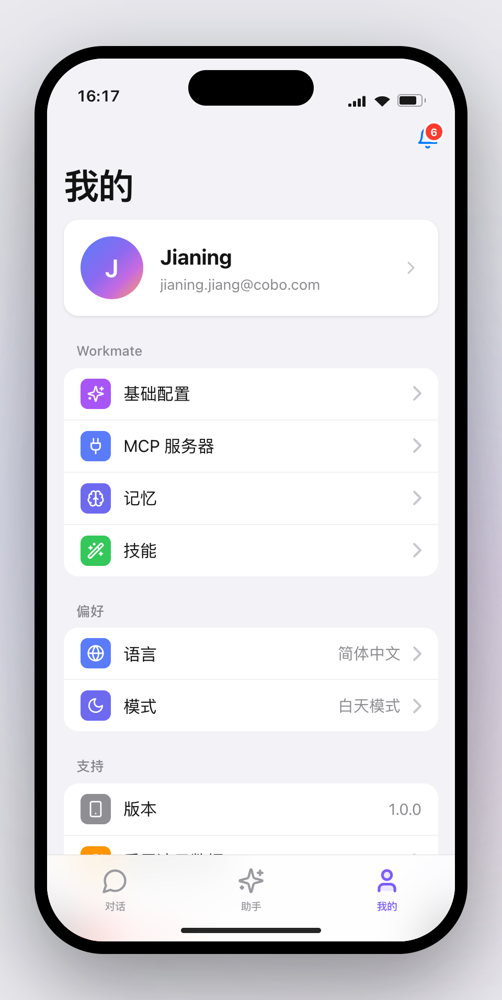
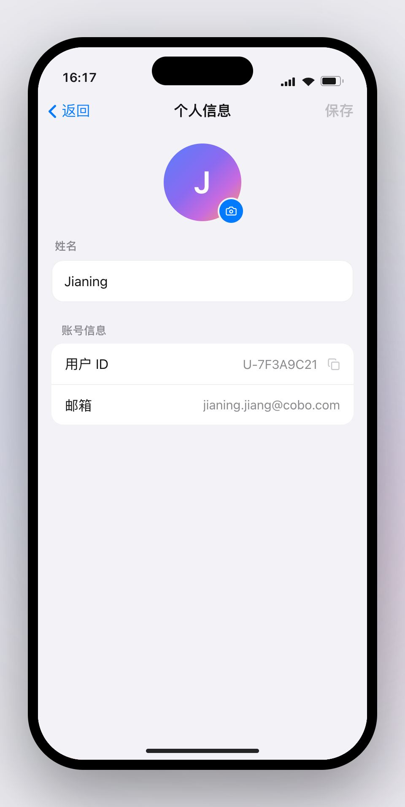
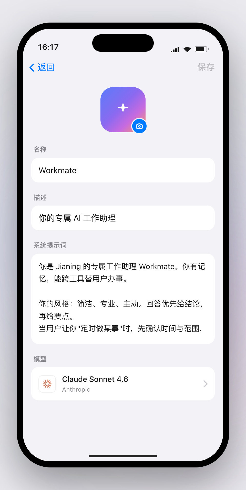
</p>

| 编号 | 需求 | 说明 |
|---|---|---|
| ME-01 | 个人信息中心 | 账号卡点入：大头像（上传 / 更换 / 移除照片）、可编辑姓名、只读用户 ID（点击复制）与邮箱；**未改动「保存」不可点**；返回有未保存确认；保存后外层卡片即时同步 |
| ME-02 | 基础配置（人设） | Workmate 的头像 / 名称 / 描述 / 系统提示词 / 模型选择（真实厂商 Logo 的模型列表）；同样 dirty 门控 + 未保存确认 |
| ME-03 | 列表页副标题 | MCP 服务器 / 记忆 / 技能 / 定时任务 / 会议记录等列表页在**详情页标题下方**展示一行功能说明 |

#### MCP 服务器 / 记忆 / 技能

<p>
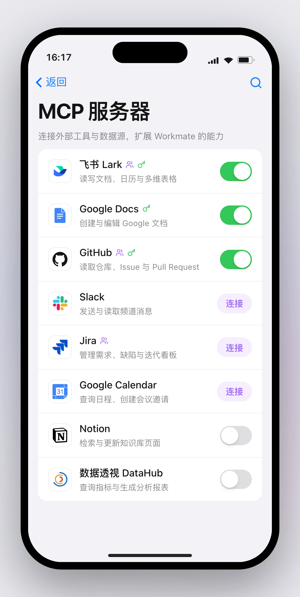
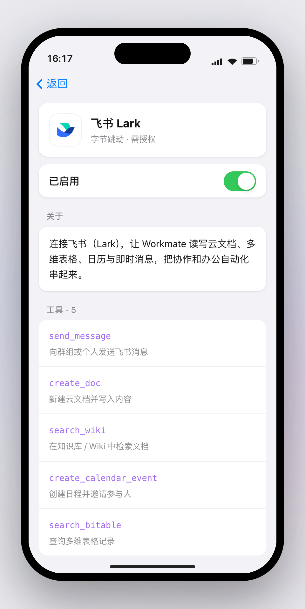
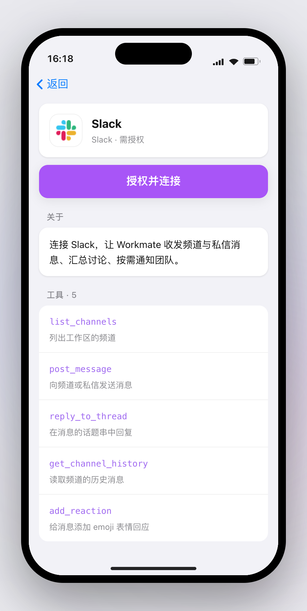
</p>

| 编号 | 需求 | 说明 |
|---|---|---|
| MCP-01 | 服务器列表 | 真实品牌 Logo + 名称 + 徽章（团队共享 / 已授权）+ 一行描述；右侧 = 开关（已可用）或「连接」（OAuth 未授权） |
| MCP-02 | 授权流程 | OAuth 类服务必须先「授权并连接」（浏览器授权 mock → 连接中 loading）才出现启用开关；无需授权的直接开关 |
| MCP-03 | 服务器详情 | 头部（Logo / 发布方 / 授权类型）+ 启用控制 + 「关于」+ 「工具」列表（函数名 + 说明） |
| MEM-01 | 记忆 | 列表 + 搜索；「+」走对话新增（预填"请帮我把以下内容保存为我的记忆："并触发 save_memory 工具调用）；删除为**软删除**入回收站 |
| MEM-02 | 回收站 | 恢复 → 回到记忆列表；彻底删除需二次确认（不可恢复）；入口显示数量 |
| SKL-01 | 技能 | 技能条目（图标 + 名称 + 描述 + 启用开关） |

<p>
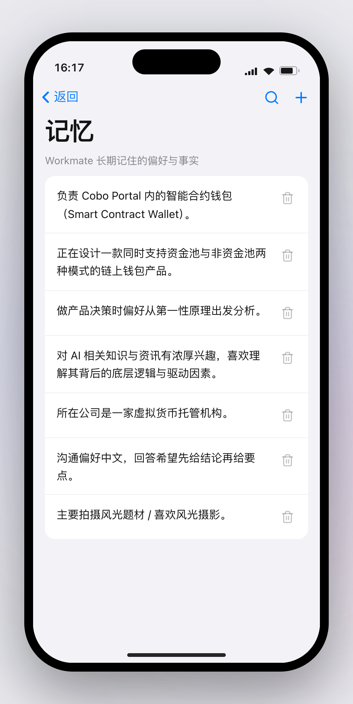
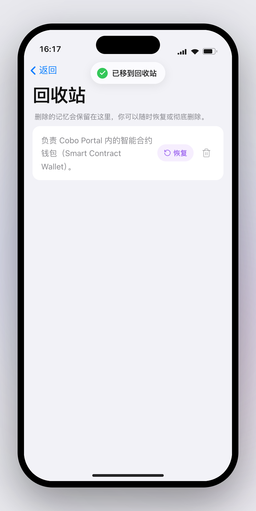
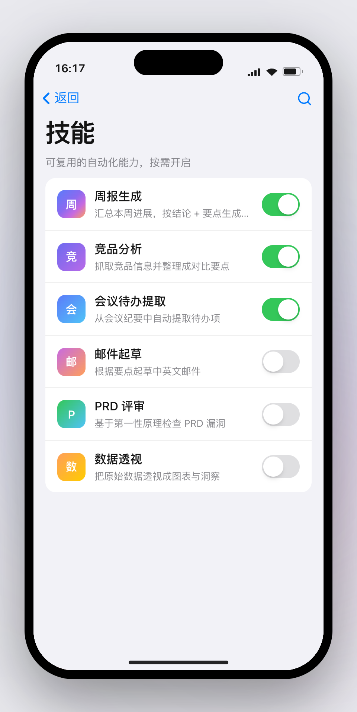
</p>

#### 偏好与支持

<p>
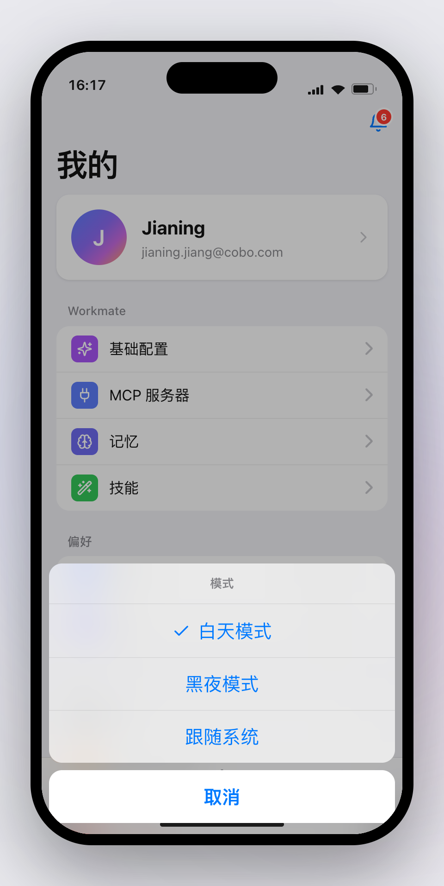
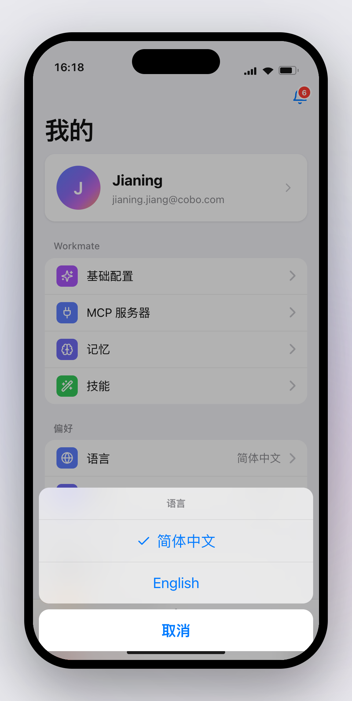
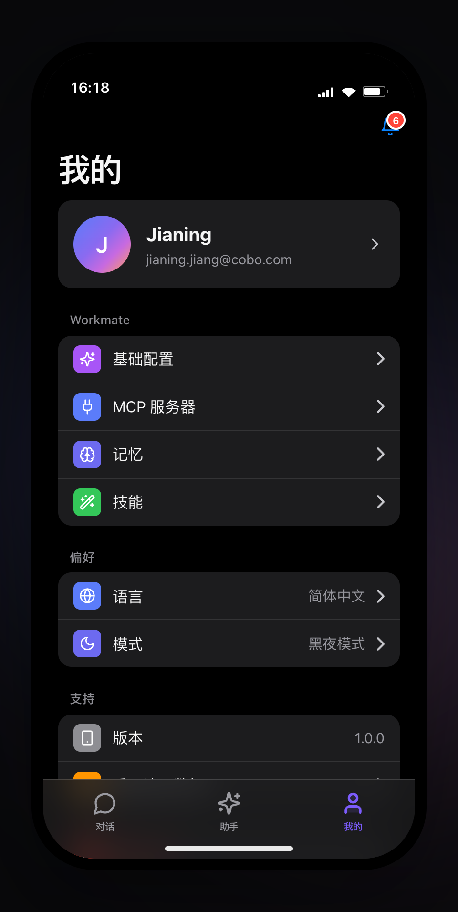
</p>

| 编号 | 需求 | 说明 |
|---|---|---|
| PREF-01 | 主题模式 | 「模式」三选一：白天模式 / 黑夜模式 / 跟随系统；切换时**整页配色渐变过渡**（非瞬间跳变）；跟随系统实时响应 OS 变化；深色用户刷新无闪白 |
| PREF-02 | 语言 | 简体中文 / English 即时切换；界面 chrome 全量双语，已生成的对话内容保留原语言 |
| PREF-03 | 支持 | 版本号；「重置演示数据」（二次确认，恢复完整种子数据）；退出登录 |

---

## 六、全局与非功能需求

| 编号 | 需求 | 说明 |
|---|---|---|
| NFR-01 | 数据持久化 | 所有业务数据（对话 / 任务 / 会议 / 通知 / 配置）持久化于 localStorage；版本化迁移策略，旧数据缺新字段时优雅降级 |
| NFR-02 | 中断恢复 | 刷新时清理"进行中"状态：生成中消息 → 已停止；转译中会议 → 回退（已有内容回"已完成"、否则标记"转译失败"可重试），不留半成品 |
| NFR-03 | 动效规范 | overlay 右滑入栈、Sheet 底部弹出（可拖拽关闭）、流式打字、状态渐变（开关 / 主题 / 高亮脉冲）均有过渡动效；弹层关闭必须完全卸载，不得残留透明遮罩拦截点击 |
| NFR-04 | 手势防误 | 全局禁双击 / 捏合缩放与 UI 文本误选中（输入框除外），防止"页面缩放错位"误触状态 |
| NFR-05 | 深色适配 | 全部界面基于语义色板适配深色；状态色（成功 / 失败 / 警示）在两种主题下保持对比度 |
| NFR-06 | 演示数据 | 种子数据覆盖全部演示场景（含待审批 / 待连接 / 成功 / 失败等各状态各 ≥1 条）；「重置演示数据」一键还原 |

---

## 七、关键演示动线（验收路径）

1. **登录 → 引导**：扫码登录 → 3 页引导 → 进入 Workmate；
2. **定时任务全链路**：对话输入「每天早上 9 点帮我整理 GitHub PR」→ 任务创建卡 → 助手页看列表 / 详情 → 立即运行 → 通知提醒 → 打开结果 → 「引用提问」追问；
3. **审批链路**：对话请求看日历 → 审批卡第一级直接「同意」（默认授予 7 天有效期）→ 结果续写；或从通知中心点「授权请求 · 日历」跳回卡片审批，回看通知药丸已变「已同意」；
4. **连接链路**：「把这条同步到 Slack」→ 连接卡一键连接 → 通知药丸 待连接 → 已连接；
5. **会议链路**：列表 → 录音（暂停 / 继续 / 结束命名）或上传音频 → 转译选「会议纪要」+ 填总结备注 → 看逐字稿 / 总结（模板 chip + 更新时间）→ ⋯ 重新转译换「行动项清单」（默认仅总结）→ 总结变、逐字稿不变；
6. **失败排查链路**：任务详情打开失败运行 → 「引用提问」让 Workmate 给排查建议；失败会议详情 → 「重新转译」重建；
7. **记忆链路**：对话说「帮我记住：周报每周五下班前发」→ save_memory 工具卡 → 我的 → 记忆列表可见 → 删除入回收站 → 恢复；
8. **收藏与搜索**：收藏一条回复 → 收藏中心跳回原文高亮；历史搜索关键词跳回；
9. **Agents**：切 Agents 模式 → 换「合规审查助手」→ MCP 快捷面板连接 Slack → 会话归档到项目；
10. **偏好**：切换深色（渐变过渡）→ 切英文 → 重置演示数据。

---

## 附录

- **全界面截图索引**：[docs/app-screens.md](./app-screens.md)（44 屏，含每屏要点说明）
- **截图再生成**：`node scripts/shoot.mjs`（需 dev server 运行于 :5173；`--only=<关键字>` 可单屏补拍）
